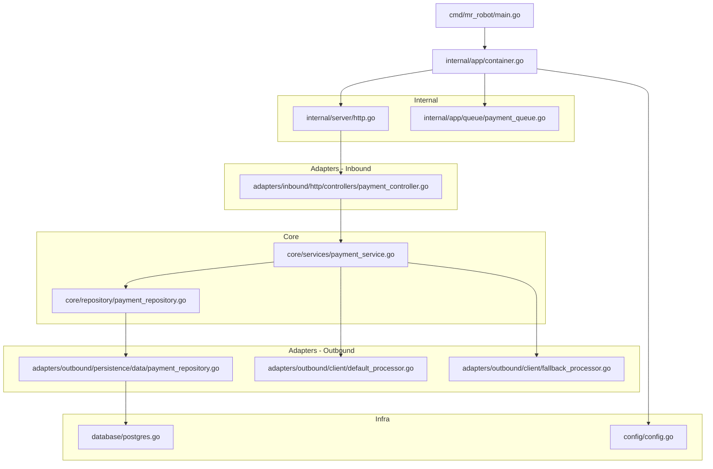

# mr-robot

A backend API

## Fluxograma

```mermaid
flowchart TD
    A[cmd/mr_robot/main.go] --> B[internal/app/container.go]
    B --> C[internal/server/http.go]
    B --> Q[internal/app/queue/payment_queue.go]

    C --> D[adapters/inbound/http/controllers/payment_controller.go]
    D --> E[core/services/payment_service.go]
    E --> F[core/repository/payment_repository.go]

    F --> G[adapters/outbound/persistence/data/payment_repository.go]
    G --> H[database/postgres.go]

    E --> I[adapters/outbound/client/default_processor.go]
    E --> J[adapters/outbound/client/fallback_processor.go]

    B --> K[config/config.go]

    subgraph "Adapters - Inbound"
        D
    end

    subgraph "Core"
        E
        F
    end

    subgraph "Adapters - Outbound"
        G
        I
        J
    end

    subgraph "Infra"
        H
        K
    end

    subgraph "Internal"
        C
        Q
    end

```
