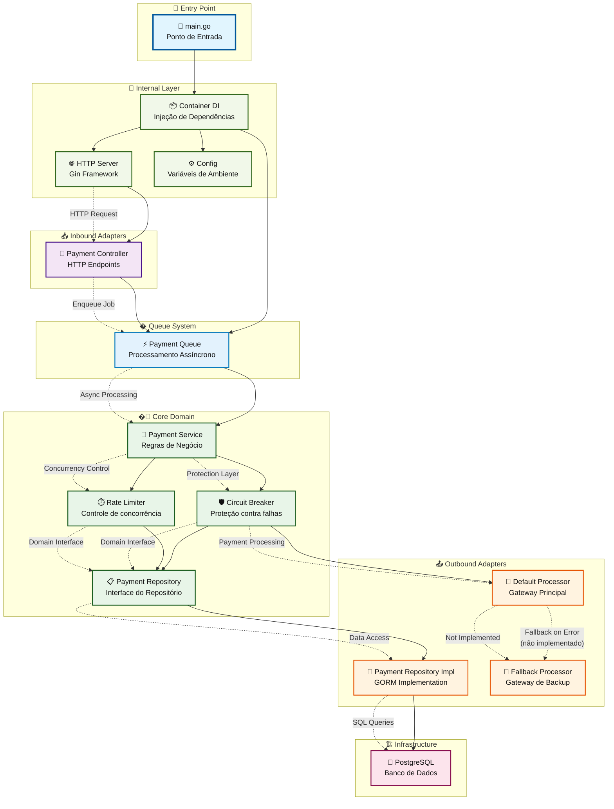

# Mr Robot


Uma API backend desenvolvida em Go para processamento de pagamentos, implementando uma arquitetura hexagonal (ports and adapters) com padrões de Clean Architecture.

## 📋 Sobre o Projeto

O Mr Robot é uma API REST para processamento de pagamentos que implementa:

- **Arquitetura Hexagonal**: Separação clara entre domínio, adaptadores e infraestrutura
- **Clean Architecture**: Inversão de dependências e isolamento do domínio
- **Processamento com Fallback**: Sistema de processamento principal com fallback automático
- **Queue System**: Sistema de filas para processamento assíncrono
- **PostgreSQL**: Persistência robusta com GORM
- **Docker**: Ambiente containerizado para desenvolvimento e produção

### Tecnologias Utilizadas

- **Go 1.24**: Linguagem principal
- **Gin**: Framework web HTTP
- **GORM**: ORM para PostgreSQL
- **PostgreSQL**: Banco de dados relacional
- **Docker & Docker Compose**: Containerização
- **Air**: Hot reload para desenvolvimento

## 🏗️ Arquitetura

A aplicação segue os princípios da arquitetura hexagonal, organizando o código em camadas bem definidas:

- **`cmd/`**: Ponto de entrada da aplicação
- **`core/`**: Domínio e regras de negócio (entities, services, repositories interfaces)
- **`adapters/inbound/`**: Adaptadores de entrada (controllers HTTP)
- **`adapters/outbound/`**: Adaptadores de saída (repositórios, gateways externos)
- **`internal/`**: Configurações internas da aplicação (container DI, servidor HTTP, filas)
- **`config/`**: Configurações e variáveis de ambiente
- **`database/`**: Configuração do banco de dados

## 🔄 Fluxograma da Arquitetura



### 📝 Legenda do Fluxograma

- **🚀 Entry Point**: Ponto de entrada da aplicação
- **🔧 Internal Layer**: Configurações internas e infraestrutura da aplicação
- **📥 Inbound Adapters**: Adaptadores de entrada (HTTP Controllers)
- **� Queue System**: Sistema de filas para processamento assíncrono
- **�💚 Core Domain**: Camada de domínio com regras de negócio e proteções
- **📤 Outbound Adapters**: Adaptadores de saída (Repositórios e Gateways)
- **🏗️ Infrastructure**: Infraestrutura externa (Banco de dados)

### 🔀 Fluxo de Processamento de Pagamento

1. **Requisição HTTP** chega no `Payment Controller`
2. **Controller** envia job para a `Payment Queue` (processamento assíncrono)
3. **Payment Queue** processa jobs usando workers e chama o `Payment Service`
4. **Payment Service** aplica proteções (`Circuit Breaker` e `Rate Limiter`)
5. **Service** utiliza o `Payment Repository` para persistir dados
6. **Service** processa pagamento via `Default Processor`
7. Em caso de falha, deveria utilizar o `Fallback Processor` (ainda não implementado)
8. **Dados** são persistidos no PostgreSQL via GORM

### ⚠️ **Status da Implementação**

- ✅ **Implementado**: Queue System, Circuit Breaker, Rate Limiter, Default Processor
- 🚧 **Parcialmente**: Fallback Processor (código existe mas não está integrado)
- ❌ **Não implementado**: Integração completa do sistema de fallback

## 🚀 Como executar o projeto

### Pré-requisitos

- **Docker** (versão 20.10+) e **Docker Compose** (versão 2.0+)
- **Git** para clonar o repositório
- **Make** para executar comandos do Makefile
- **Go 1.24+** (apenas se executar fora do container)

### Configuração do ambiente

1. **Clone o repositório**:

   ```bash
   git clone https://github.com/fabianoflorentino/mr-robot.git
   cd mr-robot
   ```

2. **Configure as variáveis de ambiente**:

   Copie o arquivo de exemplo para o diretório de configuração:

   ```bash
   cp .env.example config/.env
   ```

   O arquivo `.env.example` contém todas as variáveis necessárias com valores padrão.

3. **Edite o arquivo `.env` conforme necessário**:

   ```bash
   vim config/.env
   ```

   As principais variáveis que você pode querer ajustar:
   - `POSTGRES_PASSWORD`: Senha do banco de dados
   - `APP_PORT`: Porta da aplicação (padrão: 8888)
   - `DEBUG`: Modo debug (true/false)
   - `LOG_LEVEL`: Nível de log (debug, info, warn, error)

### Executando em modo de desenvolvimento

Para executar o projeto em modo de desenvolvimento com hot-reload:

```bash
# Subir todos os serviços em modo desenvolvimento
make dev-up

# Verificar logs da aplicação
make dev-logs

# Verificar logs do banco de dados
make dev-logs-db
```

A aplicação estará disponível em: `http://localhost:8888`

O banco PostgreSQL estará disponível em: `localhost:5432`

### Executando em modo de produção

Para executar o projeto em modo de produção:

```bash
# Subir todos os serviços em modo produção
make prod-up

# Verificar logs da aplicação
make prod-logs

# Parar serviços de produção
make prod-down
```

### Comandos úteis

```bash
# Parar todos os serviços de desenvolvimento
make dev-down

# Rebuild da aplicação em desenvolvimento
make dev-rebuild

# Subir apenas o banco de dados
make dev-db-up

# Ver status dos containers
make dev-status

# Acessar o container da aplicação
make dev-exec

# Acessar o banco de dados
make dev-db-exec

# Executar testes
make test

# Executar testes com coverage
make test-coverage

# Limpar containers e volumes
make dev-clean
```

### Estrutura do Projeto

```text
mr-robot/
├── cmd/mr_robot/            # Ponto de entrada da aplicação
├── core/                    # Domínio e regras de negócio
│   ├── domain/              # Entidades do domínio
│   ├── services/            # Serviços do domínio
│   └── repository/          # Interfaces dos repositórios
├── adapters/                # Adaptadores da arquitetura hexagonal
│   ├── inbound/http/        # Controllers HTTP
│   └── outbound/            # Gateways e repositórios
├── internal/                # Configurações internas
│   ├── app/                 # Container de dependências
│   └── server/              # Servidor HTTP
├── config/                  # Configurações da aplicação
├── database/                # Configuração do banco de dados
├── build/                   # Dockerfiles e configurações de build
├── infra/                   # Infraestrutura (payment-processor mock)
├── .env.example             # Exemplo de variáveis de ambiente
├── Makefile                 # Comandos de automação
├── VERSION                  # Arquivo de versionamento
├── docker-compose.dev.yml   # Ambiente de desenvolvimento
└── docker-compose.prod.yml  # Ambiente de produção
```

## 📝 API Endpoints

A API fornece os seguintes endpoints para processamento de pagamentos:

```http
POST /payments           # Processar um novo pagamento
GET /payment-summary     # Resumo dos pagamentos processados
GET /health              # Health check da aplicação
```

### Exemplo de payload para processamento de pagamento

```json
{
  "correlationId": "550e8400-e29b-41d4-a716-446655440000",
  "amount": 100.50
}
```

## 🧪 Testes

```bash
# Executar testes via Makefile
make test

# Executar testes com coverage
make test-coverage

# Executar testes diretamente no container
make dev-exec
go test ./...

# Executar testes com coverage detalhado
make dev-exec
go test -cover -coverprofile=coverage.out ./...
go tool cover -html=coverage.out -o coverage.html
```

## 📊 Monitoramento

A aplicação possui health checks configurados:

- **Aplicação**: Verifica se o processo Air está rodando
- **Banco de dados**: Verifica conectividade com PostgreSQL

### Endpoints de Health Check

```http
GET /health              # Health check geral da aplicação
```

## 🌐 Serviços Externos

O projeto inclui um mock do processador de pagamentos localizado em `infra/payment-processor/`:

```bash
# Subir apenas o mock do processador
cd infra/payment-processor
docker-compose up -d
```

Este serviço simula um gateway de pagamento externo para testes de integração.

## 🔧 Desenvolvimento

### Hot Reload

O projeto utiliza [Air](https://github.com/cosmtrek/air) para hot reload durante o desenvolvimento. As configurações estão em `build/air.toml`.

### Estrutura de Dados

A aplicação trabalha com a entidade principal `Payment`:

```go
type Payment struct {
    CorrelationID uuid.UUID `json:"correlationId" binding:"required"`
    Amount        float64   `json:"amount" binding:"required,gt=0"`
}
```

## 🎯 Funcionalidades Implementadas

- ✅ **API REST**: Endpoints para processamento de pagamentos
- ✅ **Arquitetura Hexagonal**: Separação de responsabilidades
- ✅ **Clean Architecture**: Inversão de dependências
- ✅ **Queue System**: Sistema de filas para processamento assíncrono com workers
- ✅ **Circuit Breaker**: Proteção contra falhas em cascata
- ✅ **Rate Limiter**: Controle de taxa de processamento concorrente
- ✅ **GORM**: ORM para PostgreSQL com retry automático
- ✅ **Docker**: Ambiente containerizado
- ✅ **Hot Reload**: Desenvolvimento com Air
- ✅ **Health Check**: Monitoramento da aplicação
- ✅ **Makefile**: Automação de tarefas
- ✅ **Versionamento**: Controle unificado de versões
- ✅ **Environment**: Configuração via variáveis de ambiente

## 🚧 Roadmap

- [ ] **Fallback Integration**: Integrar o Fallback Processor ao Payment Service
- [ ] **Observabilidade**: Métricas e logging estruturado
- [ ] **Testes de Integração**: Cobertura completa de testes
- [ ] **CI/CD**: Pipeline de integração contínua
- [ ] **Monitoring**: Dashboard de métricas e alertas
- [ ] **Graceful Shutdown**: Finalização elegante do processamento de filas
- [ ] **Dead Letter Queue**: Fila para jobs que falharam múltiplas vezes

## 📋 Versão Atual

**Versão**: v0.0.1
