# Mr Robot


Uma API backend desenvolvida em Go para processamento de pagamentos, implementando uma arquitetura hexagonal (ports and adapters) com padrões de Clean Architecture.

## 📋 Sobre o Projeto

O Mr Robot é uma API REST para processamento de pagamentos que implementa:

- **Arquitetura Hexagonal**: Separação clara entre domínio, adaptadores e infraestrutura
- **Clean Architecture**: Inversão de dependências e isolamento do domínio
- **Processamento com Fallback**: Sistema de processamento principal com fallback automático
- **Queue System**: Sistema de filas para processamento assíncrono
- **PostgreSQL**: Persistência robusta com GORM
- **Docker**: Ambiente containerizado para desenvolvimento e produção

### Tecnologias Utilizadas

- **Go 1.24**: Linguagem principal
- **Gin**: Framework web HTTP
- **GORM**: ORM para PostgreSQL
- **PostgreSQL**: Banco de dados relacional
- **Docker & Docker Compose**: Containerização
- **Air**: Hot reload para desenvolvimento

## 🏗️ Arquitetura

A aplicação segue os princípios da arquitetura hexagonal, organizando o código em camadas bem definidas:

- **`cmd/`**: Ponto de entrada da aplicação
- **`core/`**: Domínio e regras de negócio (entities, services, repositories interfaces)
- **`adapters/inbound/`**: Adaptadores de entrada (controllers HTTP)
- **`adapters/outbound/`**: Adaptadores de saída (repositórios, gateways externos)
- **`internal/`**: Configurações internas da aplicação (container DI, servidor HTTP, filas)
- **`config/`**: Configurações e variáveis de ambiente
- **`database/`**: Configuração do banco de dados

## 🔄 Fluxograma da Arquitetura

```mermaid
flowchart TD
    %% Definindo estilos
    classDef entrypoint fill:#e1f5fe,stroke:#01579b,stroke-width:3px
    classDef inbound fill:#f3e5f5,stroke:#4a148c,stroke-width:2px
    classDef core fill:#e8f5e8,stroke:#1b5e20,stroke-width:2px
    classDef outbound fill:#fff3e0,stroke:#e65100,stroke-width:2px
    classDef infra fill:#fce4ec,stroke:#880e4f,stroke-width:2px
    classDef internal fill:#f1f8e9,stroke:#33691e,stroke-width:2px

    %% Forçar cor do texto preta para todos os nós
    style A color:#111,fill:#e1f5fe,stroke:#01579b,stroke-width:3px
    style B color:#111,fill:#f1f8e9,stroke:#33691e,stroke-width:2px
    style C color:#111,fill:#f1f8e9,stroke:#33691e,stroke-width:2px
    style Q color:#111,fill:#f1f8e9,stroke:#33691e,stroke-width:2px
    style K color:#111,fill:#f1f8e9,stroke:#33691e,stroke-width:2px
    style D color:#111,fill:#f3e5f5,stroke:#4a148c,stroke-width:2px
    style E color:#111,fill:#e8f5e8,stroke:#1b5e20,stroke-width:2px
    style F color:#111,fill:#e8f5e8,stroke:#1b5e20,stroke-width:2px
    style G color:#111,fill:#fff3e0,stroke:#e65100,stroke-width:2px
    style I color:#111,fill:#fff3e0,stroke:#e65100,stroke-width:2px
    style J color:#111,fill:#fff3e0,stroke:#e65100,stroke-width:2px
    style H color:#111,fill:#fce4ec,stroke:#880e4f,stroke-width:2px

    %% Componentes principais
    A[🚀 main.go<br/>Ponto de Entrada] --> B[📦 Container DI<br/>Injeção de Dependências]

    B --> C[🌐 HTTP Server<br/>Gin Framework]
    B --> Q[⚡ Payment Queue<br/>Processamento Assíncrono]
    B --> K[⚙️ Config<br/>Variáveis de Ambiente]

    %% Fluxo HTTP
    C --> D[🎯 Payment Controller<br/>HTTP Endpoints]
    D --> E[💼 Payment Service<br/>Regras de Negócio]

    %% Core Domain
    E --> F[📋 Payment Repository<br/>Interface do Repositório]

    %% Persistência
    F --> G[💾 Payment Repository Impl<br/>GORM Implementation]
    G --> H[🐘 PostgreSQL<br/>Banco de Dados]

    %% Gateways de Pagamento
    E --> I[🏦 Default Processor<br/>Gateway Principal]
    E --> J[🔄 Fallback Processor<br/>Gateway de Backup]

    %% Agrupamentos por camadas
    subgraph "🚀 Entry Point"
        A
    end

    subgraph "🔧 Internal Layer"
        B
        C
        Q
        K
    end

    subgraph "📥 Inbound Adapters"
        D
    end

    subgraph "💚 Core Domain"
        E
        F
    end

    subgraph "📤 Outbound Adapters"
        G
        I
        J
    end

    subgraph "🏗️ Infrastructure"
        H
    end

    %% Aplicando estilos
    class A entrypoint
    class D inbound
    class E,F core
    class G,I,J outbound
    class H infra
    class B,C,Q,K internal

    %% Setas com labels
    C -.->|"HTTP Request"| D
    D -.->|"Business Logic"| E
    E -.->|"Domain Interface"| F
    F -.->|"Data Access"| G
    G -.->|"SQL Queries"| H
    E -.->|"Payment Processing"| I
    I -.->|"Fallback on Error"| J
```



### 📝 Legenda do Fluxograma

- **🚀 Entry Point**: Ponto de entrada da aplicação
- **🔧 Internal Layer**: Configurações internas e infraestrutura da aplicação
- **📥 Inbound Adapters**: Adaptadores de entrada (HTTP Controllers)
- **💚 Core Domain**: Camada de domínio com regras de negócio
- **📤 Outbound Adapters**: Adaptadores de saída (Repositórios e Gateways)
- **🏗️ Infrastructure**: Infraestrutura externa (Banco de dados)

### 🔀 Fluxo de Processamento de Pagamento

1. **Requisição HTTP** chega no `Payment Controller`
2. **Controller** delega para o `Payment Service` (core business)
3. **Service** utiliza o `Payment Repository` para persistir dados
4. **Service** processa pagamento via `Default Processor`
5. Em caso de falha, utiliza o `Fallback Processor`
6. **Dados** são persistidos no PostgreSQL via GORM

## 🚀 Como executar o projeto

### Pré-requisitos

- Docker e Docker Compose instalados
- Git

### Configuração do ambiente

1. **Clone o repositório**:

   ```bash
   git clone https://github.com/fabianoflorentino/mr-robot.git
   cd mr-robot
   ```

2. **Configure as variáveis de ambiente**:

   ```bash
   cp config/_env config/.env
   ```

3. **Edite o arquivo `.env` conforme necessário**:

   ```bash
   vim config/.env
   ```

### Executando em modo de desenvolvimento

Para executar o projeto em modo de desenvolvimento com hot-reload:

```bash
# Subir todos os serviços
docker-compose up -d

# Verificar logs da aplicação
docker-compose logs -f mr_robot

# Verificar logs do banco de dados
docker-compose logs -f db
```

A aplicação estará disponível em: `http://localhost:8888`

O banco PostgreSQL estará disponível em: `localhost:5432`

### Comandos úteis

```bash
# Parar todos os serviços
docker-compose down

# Rebuild da aplicação
docker-compose up --build

# Executar apenas o banco de dados
docker-compose up db

# Ver status dos containers
docker-compose ps

# Acessar o container da aplicação
docker-compose exec mr_robot sh

# Acessar o banco de dados
docker-compose exec db psql -U mr_robot -d mr_robot
```

### Estrutura do Projeto

```text
mr-robot/
├── cmd/mr_robot/           # Ponto de entrada da aplicação
├── core/                   # Domínio e regras de negócio
│   ├── domain/            # Entidades do domínio
│   ├── services/          # Serviços do domínio
│   └── repository/        # Interfaces dos repositórios
├── adapters/              # Adaptadores da arquitetura hexagonal
│   ├── inbound/http/      # Controllers HTTP
│   └── outbound/          # Gateways e repositórios
├── internal/              # Configurações internas
│   ├── app/              # Container de dependências
│   └── server/           # Servidor HTTP
├── config/               # Configurações da aplicação
├── database/            # Configuração do banco de dados
├── build/               # Dockerfiles e configurações de build
└── docker-compose.yml   # Orquestração de containers
```

## 📝 API Endpoints

A API fornece os seguintes endpoints para processamento de pagamentos:

```http
POST /payments           # Processar um novo pagamento
GET  /payments/:id       # Consultar status de um pagamento
GET  /health            # Health check da aplicação
```

### Exemplo de payload para processamento de pagamento

```json
{
  "correlation_id": "550e8400-e29b-41d4-a716-446655440000",
  "amount": 100.50
}
```

## 🧪 Testes

```bash
# Executar testes
docker-compose exec mr_robot go test ./...

# Executar testes com coverage
docker-compose exec mr_robot go test -cover ./...
```

## 📊 Monitoramento

A aplicação possui health checks configurados:

- **Aplicação**: Verifica se o processo Air está rodando
- **Banco de dados**: Verifica conectividade com PostgreSQL

## 🔧 Desenvolvimento

### Hot Reload

O projeto utiliza [Air](https://github.com/cosmtrek/air) para hot reload durante o desenvolvimento. As configurações estão em `build/air.toml`.

### Estrutura de Dados

A aplicação trabalha com a entidade principal `Payment`:

```go
type Payment struct {
    CorrelationID uuid.UUID `json:"correlation_id"`
    Amount        float64   `json:"amount"`
}
```
