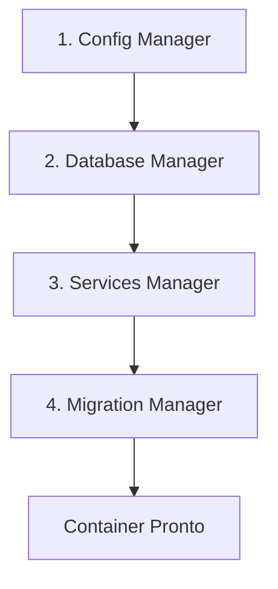

# Arquitetura do Diretório App - Guia de Manutenção

> **Consulte também**: [📖 ARCHITECTURE_GUIDE.md](ARCHITECTURE_GUIDE.md) para padrões gerais e convenções consolidadas.

Este documento foca especificamente no **diretório `internal/app`** e seu sistema de Dependency Injection Container.

## 🎯 Responsabilidades Específicas

O diretório `internal/app` implementa o padrão **Dependency Injection Container** e é responsável por:

- ⚙️ Gerenciamento de configurações
- 🗄️ Inicialização do banco de dados
- 🔧 Configuração de serviços
- 📊 Execução de migrações
- 🚦 Controle de ciclo de vida da aplicação

## 📁 Estrutura do Diretorio App

```text
internal/app/
├── container.go              # 🏗️ Container principal de DI
├── container_builder.go      # 🔨 Builder pattern para construção
├── container_test.go         # 🧪 Testes do container
├── interfaces.go            # 📝 Interfaces dos componentes
├── config/                  # ⚙️ Gerenciamento de configuração
│   └── manager.go
├── database/               # 🗄️ Gerenciamento de banco de dados
│   └── manager.go
├── services/              # 🔧 Gerenciamento de serviços
│   └── manager.go
├── migration/             # 📊 Gerenciamento de migrações
│   └── manager.go
├── queue/                # 📬 Sistema de filas
│   └── payment_queue.go
└── interfaces/           # 📋 Interfaces específicas
    └── payment_service.go
```

### 🧩 Componentes Principais

| Componente | Responsabilidade | Arquivo Principal |
|------------|------------------|-------------------|
| **Container** | Orquestração geral e DI | `container.go` |
| **Config Manager** | Carregamento de configurações | `config/manager.go` |
| **Database Manager** | Conexão com PostgreSQL | `database/manager.go` |
| **Services Manager** | Inicialização de serviços | `services/manager.go` |
| **Migration Manager** | Execução de migrações | `migration/manager.go` |

## 🔄 Fluxo de Inicializacao

O `AppContainer` segue uma sequência específica de inicialização:



### Sequência Detalhada

1. **📋 Configuração**: Carrega variáveis de ambiente
2. **🗄️ Banco de Dados**: Estabelece conexão com PostgreSQL
3. **🔧 Serviços**: Inicializa serviços de negócio (Payment, Queue)
4. **📊 Migrações**: Executa migrações pendentes

## ➕ Como Adicionar Nova Configuracao

### Passo 1: Definir Estrutura da Configuração

Edite `config/app_config.go`:

```go
// Adicione sua nova estrutura
type NovaConfig struct {
    Campo1 string
    Campo2 int
    Campo3 bool
    // Adicione campos conforme necessário
}

// Integre na AppConfig
type AppConfig struct {
    Database DatabaseConfig
    Payment  PaymentConfig
    Queue    QueueConfig
    Nova     NovaConfig  // ⬅️ Nova configuração aqui
}
```

### Passo 2: Implementar Carregamento de Variáveis

Na função `LoadAppConfig()`:

```go
func LoadAppConfig() (*AppConfig, error) {
    // ... código existente ...

    // Conversões com tratamento de erro
    campo2, err := strconv.Atoi(getEnvOrDefault("NOVA_CAMPO2", "42"))
    if err != nil {
        campo2 = 42
    }

    campo3, err := strconv.ParseBool(getEnvOrDefault("NOVA_CAMPO3", "false"))
    if err != nil {
        campo3 = false
    }

    return &AppConfig{
        // ... configurações existentes ...
        Nova: NovaConfig{
            Campo1: getEnvOrDefault("NOVA_CAMPO1", "valor_default"),
            Campo2: campo2,
            Campo3: campo3,
        },
    }, nil
}
```

### Passo 3: Criar Manager (se necessário)

Para componentes complexos, crie `internal/app/nova/manager.go`:

```go
package nova

import (
    "fmt"
    "github.com/fabianoflorentino/mr-robot/config"
)

type Manager struct {
    config *config.AppConfig
    // outros campos necessários
}

func NewManager(cfg *config.AppConfig) *Manager {
    return &Manager{
        config: cfg,
    }
}

func (n *Manager) Initialize() error {
    // 🚀 Lógica de inicialização
    fmt.Printf("Inicializando Nova com configuração: %+v\n", n.config.Nova)
    return nil
}

func (n *Manager) Shutdown() {
    // 🛑 Lógica de shutdown
    fmt.Println("Finalizando Nova...")
}

// Adicione métodos específicos do componente
func (n *Manager) GetSomeService() SomeServiceInterface {
    // implementação
}
```

### Passo 4: Integrar no Container

Modifique `container.go`:

```go
import (
    // ... imports existentes ...
    "github.com/fabianoflorentino/mr-robot/internal/app/nova"
)

type AppContainer struct {
    configManager    *config.Manager
    databaseManager  *database.Manager
    serviceManager   *appServices.Manager
    migrationManager *migration.Manager
    novaManager      *nova.Manager  // ⬅️ Novo manager
}

func NewAppContainer() (Container, error) {
    container := &AppContainer{}

    // Steps 1-4: inicializações existentes...

    // Step 5: Initialize nova manager
    container.novaManager = nova.NewManager(container.configManager.GetConfig())
    if err := container.novaManager.Initialize(); err != nil {
        return nil, fmt.Errorf("failed to initialize nova: %w", err)
    }

    return container, nil
}
```

### Passo 5: Atualizar Interface (se necessário)

Se outros componentes precisam acessar, atualize a interface:

```go
type Container interface {
    GetDB() *gorm.DB
    GetPaymentService() interfaces.PaymentServiceInterface
    GetPaymentQueue() *queue.PaymentQueue
    GetNovaManager() *nova.Manager  // ⬅️ Novo método
    Shutdown() error
}

// Implementar o método no AppContainer
func (c *AppContainer) GetNovaManager() *nova.Manager {
    return c.novaManager
}
```

### Passo 6: Atualizar Shutdown

No método `Shutdown()`:

```go
func (c *AppContainer) Shutdown() error {
    log.Println("Shutting down application container...")

    // Shutdown em ordem reversa da inicialização
    if c.novaManager != nil {
        log.Println("Shutting down nova...")
        c.novaManager.Shutdown()
    }

    // ... outros shutdowns existentes ...

    return nil
}
```

## 🧪 Testes Específicos do Container

### Testando Configurações

```go
func TestNovaConfig(t *testing.T) {
    // Setup
    os.Setenv("NOVA_CAMPO1", "test_value")
    os.Setenv("NOVA_CAMPO2", "100")
    defer os.Clearenv()

    // Act
    config, err := config.LoadAppConfig()

    // Assert
    assert.NoError(t, err)
    assert.Equal(t, "test_value", config.Nova.Campo1)
    assert.Equal(t, 100, config.Nova.Campo2)
}
```

### Testando Container

```go
func TestContainerWithNova(t *testing.T) {
    container, err := NewAppContainer()
    assert.NoError(t, err)
    assert.NotNil(t, container.GetNovaManager())

    defer container.Shutdown()
}
```

---

**📝 Nota**: Para convenções gerais, troubleshooting e padrões consolidados, consulte o [� ARCHITECTURE_GUIDE.md](ARCHITECTURE_GUIDE.md).
