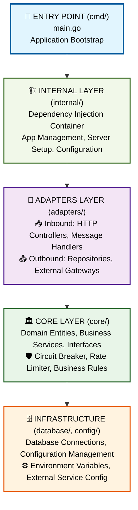

# Guia Completo de Arquitetura - mr-robot

Este documento serve como **índice principal** para toda a documentação de arquitetura da aplicação mr-robot, organizando os guias específicos de cada diretório.

## 📋 Índice de Arquiteturas

### 🏗️ Diretórios Principais

| Diretório | Responsabilidade | Guia Específico | Status |
|-----------|------------------|-----------------|---------|
| **`internal/app/`** | Dependency Injection Container | [📖 APP_ARCHITECTURE.md](APP_ARCHITECTURE.md) | ✅ Completo |
| **`core/`** | Domínio e Regras de Negócio | [📖 CORE_ARCHITECTURE.md](CORE_ARCHITECTURE.md) | ✅ Completo |
| **`adapters/`** | Ports and Adapters (Hexagonal) | [📖 ADAPTERS_ARCHITECTURE.md](ADAPTERS_ARCHITECTURE.md) | ✅ Completo |
| **`config/`** | Gerenciamento de Configurações | [📖 CONFIG_ARCHITECTURE.md](CONFIG_ARCHITECTURE.md) | ✅ Completo |
| **`database/`** | Infraestrutura de Dados | [📖 DATABASE_ARCHITECTURE.md](DATABASE_ARCHITECTURE.md) | ✅ Completo |
| **`cmd/`** | Ponto de Entrada | [📖 CMD_ARCHITECTURE.md](CMD_ARCHITECTURE.md) | 🚧 Em progresso |
| **`build/`** | Build e Deploy | [📖 BUILD_ARCHITECTURE.md](BUILD_ARCHITECTURE.md) | 🚧 Em progresso |
| **`tests/`** | Estratégia de Testes | [📖 TESTS_ARCHITECTURE.md](TESTS_ARCHITECTURE.md) | 🚧 Em progresso |

## 🎯 Visao Geral da Aplicacao

A aplicação mr-robot implementa uma **arquitetura hexagonal (ports and adapters)** combinada com **Clean Architecture**, organizando o código em camadas bem definidas:



## 🔄 Fluxo de Requisicao Completo

### 1. **Entrada** (`cmd/` → `internal/`)
```text
main.go → Container DI → HTTP Server → Routes
```

### 2. **Processamento** (`adapters/inbound` → `core/`)
```text
Controller → Validation → Service → Business Logic
```

### 3. **Saída** (`core/` → `adapters/outbound`)
```text
Repository Interface → DB Implementation → External APIs
```

### 4. **Resposta** (`adapters/` → Cliente)
```text
Response Formatting → HTTP Status → JSON Response
```

## 📚 Guias de Manutencao por Cenario

### 🆕 Para Desenvolvedores Novos

**Ordem de leitura recomendada:**

1. **[📖 APP_ARCHITECTURE.md](APP_ARCHITECTURE.md)** - Entender o container DI
2. **[📖 CORE_ARCHITECTURE.md](CORE_ARCHITECTURE.md)** - Compreender o domínio
3. **[📖 ADAPTERS_ARCHITECTURE.md](ADAPTERS_ARCHITECTURE.md)** - Aprender sobre entrada/saída
4. **[📖 CONFIG_ARCHITECTURE.md](CONFIG_ARCHITECTURE.md)** - Configurar ambiente
5. **[📖 DATABASE_ARCHITECTURE.md](DATABASE_ARCHITECTURE.md)** - Entender persistência

### ➕ Para Adicionar Nova Funcionalidade

**Fluxo recomendado:**

1. **Definir Entidade** → [📖 CORE_ARCHITECTURE.md](CORE_ARCHITECTURE.md#como-adicionar-nova-entidade)
2. **Criar Controller** → [📖 ADAPTERS_ARCHITECTURE.md](ADAPTERS_ARCHITECTURE.md#como-adicionar-novo-controller)
3. **Implementar Repository** → [📖 ADAPTERS_ARCHITECTURE.md](ADAPTERS_ARCHITECTURE.md#adaptadores-outbound)
4. **Configurar Dependências** → [📖 APP_ARCHITECTURE.md](APP_ARCHITECTURE.md#como-adicionar-nova-configuracao)

### 🔧 Para Adicionar Nova Configuração

**Passo a passo:**

1. **Estrutura de Config** → [📖 CONFIG_ARCHITECTURE.md](CONFIG_ARCHITECTURE.md#como-adicionar-nova-configuracao)
2. **Integrar no Container** → [📖 APP_ARCHITECTURE.md](APP_ARCHITECTURE.md#passo-4-integrar-no-container)
3. **Testes de Configuração** → [📖 CONFIG_ARCHITECTURE.md](CONFIG_ARCHITECTURE.md#testes)

### 🗄️ Para Modificar Banco de Dados

**Procedimento:**

1. **Nova Conexão** → [📖 DATABASE_ARCHITECTURE.md](DATABASE_ARCHITECTURE.md#como-adicionar-nova-conexao)
2. **Migrações** → [📖 DATABASE_ARCHITECTURE.md](DATABASE_ARCHITECTURE.md#migracoes-e-schema)
3. **Testes de DB** → [📖 DATABASE_ARCHITECTURE.md](DATABASE_ARCHITECTURE.md#testes)

## 🛡️ Padroes Arquiteturais Utilizados

### 🏗️ **Clean Architecture**
- **Inversão de Dependência**: Core define interfaces, adapters implementam
- **Independência de Framework**: Domínio isolado de detalhes técnicos
- **Testabilidade**: Fácil mock e teste de componentes

### 🔌 **Ports and Adapters (Hexagonal)**
- **Inbound Adapters**: HTTP, CLI, Messages (entrada)
- **Outbound Adapters**: Database, APIs, Files (saída)
- **Ports**: Interfaces que definem contratos

### 🏭 **Dependency Injection**
- **Container Centralizado**: Gerenciamento de dependências
- **Factory Pattern**: Criação controlada de objetos
- **Lifecycle Management**: Inicialização e shutdown ordenados

### 🛡️ **Resilience Patterns**
- **Circuit Breaker**: Proteção contra falhas em cascata
- **Rate Limiter**: Controle de concorrência
- **Retry Logic**: Tentativas automáticas com backoff

## 🔧 Ferramentas e Tecnologias

### 📊 **Por Camada**

| Camada | Tecnologias | Padrões |
|--------|-------------|---------|
| **Entry** | Go main, Cobra CLI | Command Pattern |
| **Internal** | DI Container, Gin Server | Factory, Singleton |
| **Adapters** | Gin HTTP, GORM ORM | Repository, Gateway |
| **Core** | Pure Go, Business Logic | Domain Model, Service |
| **Infra** | PostgreSQL, Docker | Connection Pool, Migration |

### 🧪 **Testes**

| Tipo | Framework | Localização |
|------|-----------|-------------|
| **Unit** | Testify, Mockery | `*_test.go` |
| **Integration** | TestContainers | `tests/integration/` |
| **E2E** | K6 | `tests/k6/` |
| **Architecture** | Go Test | `tests/architecture/` |

## 📈 Métricas e Monitoramento

### 🔍 **Health Checks**

```bash
# Application health
curl http://localhost:8888/health

# Database health
curl http://localhost:8888/health/database

# External services health
curl http://localhost:8888/health/processors
```

### 📊 **Métricas Disponíveis**

- **Payment Processing**: Total, success rate, processor usage
- **Queue System**: Jobs enqueued, processed, failed
- **Database**: Connection pool, query performance
- **Circuit Breaker**: State changes, failure rates
- **Rate Limiter**: Requests allowed/denied

## 🚧 Roadmap de Documentacao

### ✅ **Completo**
- [x] APP_ARCHITECTURE.md - Container DI
- [x] CORE_ARCHITECTURE.md - Domínio
- [x] ADAPTERS_ARCHITECTURE.md - Ports & Adapters
- [x] CONFIG_ARCHITECTURE.md - Configurações
- [x] DATABASE_ARCHITECTURE.md - Infraestrutura de dados

### 🚧 **Em Progresso**
- [ ] CMD_ARCHITECTURE.md - Entry point e CLI
- [ ] BUILD_ARCHITECTURE.md - Build, Docker, Deploy
- [ ] TESTS_ARCHITECTURE.md - Estratégia de testes

### 📅 **Planejado**
- [ ] API_DOCUMENTATION.md - Documentação OpenAPI
- [ ] DEPLOYMENT_GUIDE.md - Guia de deploy
- [ ] MONITORING_GUIDE.md - Observabilidade
- [ ] SECURITY_GUIDE.md - Práticas de segurança

## 🎯 Checklist de Qualidade Arquitetural

### ✅ **Verificações Básicas**

- [ ] **Core independente** de frameworks externos
- [ ] **Interfaces definidas** no domínio, implementações nos adapters
- [ ] **Configurações centralizadas** com validação
- [ ] **Testes de cada camada** com boa cobertura
- [ ] **Error handling** consistente em toda aplicação
- [ ] **Logging estruturado** para debugging
- [ ] **Health checks** implementados
- [ ] **Graceful shutdown** funcionando

### 🛡️ **Verificações Avançadas**

- [ ] **Circuit breakers** configurados adequadamente
- [ ] **Rate limiting** dimensionado para carga
- [ ] **Database migrations** versionadas
- [ ] **Connection pooling** otimizado
- [ ] **Retry policies** implementadas
- [ ] **Monitoring metrics** coletadas
- [ ] **Security headers** configurados
- [ ] **Performance benchmarks** executados

## 📞 Contato e Contribuicao

### 🤝 **Como Contribuir**

1. **Leia a documentação** relevante antes de fazer mudanças
2. **Siga os padrões** estabelecidos em cada camada
3. **Atualize a documentação** quando adicionar funcionalidades
4. **Escreva testes** para novas implementações
5. **Faça review** das verificações de qualidade

### 💬 **Canais de Comunicação**

- **Issues**: Para bugs e melhorias
- **Discussions**: Para dúvidas de arquitetura
- **Pull Requests**: Para contribuições de código
- **Wiki**: Para documentação adicional

---

**📝 Nota**: Esta documentação é viva e deve ser atualizada conforme a aplicação evolui. Mantenha-a sempre sincronizada com o código atual.
