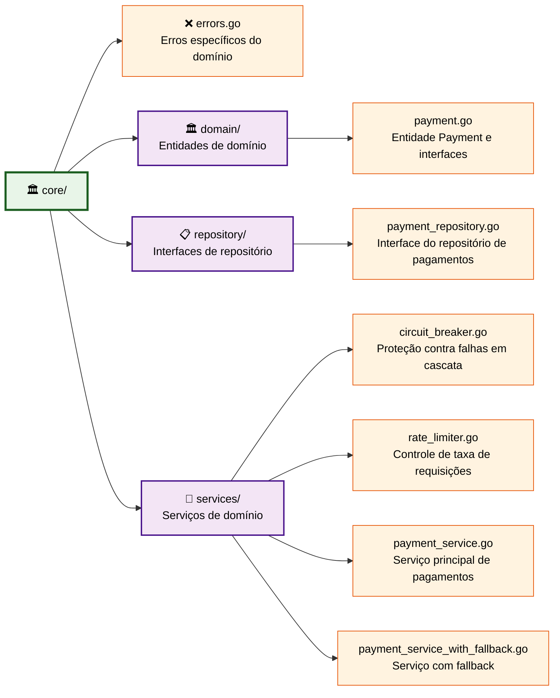

# Arquitetura do Diretório Core - Guia de Manutenção

> **Consulte também**: [📖 ARCHITECTURE_GUIDE.md](ARCHITECTURE_GUIDE.md) para padrões gerais e convenções consolidadas.

Este documento foca especificamente no **diretório `core`** - o coração da aplicação que implementa os princípios da **Clean Architecture**.

## 🎯 Responsabilidades Específicas do Core

- 🏛️ **Entidades de Domínio**: Estruturas principais do negócio
- 🔧 **Serviços de Domínio**: Regras de negócio e orquestração
- 📋 **Interfaces de Repositório**: Contratos para persistência
- 🛡️ **Proteções e Resiliência**: Circuit Breaker, Rate Limiter
- ❌ **Tratamento de Erros**: Erros específicos do domínio

## 📁 Estrutura do Diretorio Core



### 🧩 Componentes Principais

| Componente | Responsabilidade | Arquivo Principal | Tipo |
|------------|------------------|-------------------|------|
| **Payment Entity** | Estrutura de dados de pagamento | `domain/payment.go` | Entidade |
| **PaymentProcessor Interface** | Contrato para processadores | `domain/payment.go` | Interface |
| **PaymentRepository Interface** | Contrato para persistência | `repository/payment_repository.go` | Interface |
| **PaymentService** | Lógica de negócio principal | `services/payment_service.go` | Serviço |
| **Circuit Breaker** | Proteção contra falhas | `services/circuit_breaker.go` | Proteção |
| **Rate Limiter** | Controle de concorrência | `services/rate_limiter.go` | Proteção |

## 🏗️ Camadas do Dominio

### 1. **Entidades de Domínio** (`domain/`)

As entidades representam os conceitos principais do negócio:

```go
// Entidade principal de pagamento
type Payment struct {
    CorrelationID uuid.UUID `json:"correlationId" binding:"required"`
    Amount        float64   `json:"amount" binding:"required,gt=0"`
}

// Interface para processadores de pagamento
type PaymentProcessor interface {
    Process(payment *Payment) (bool, error)
    ProcessorName() string
}
```

**Características das Entidades:**

- ✅ **Independentes**: Não dependem de frameworks externos
- ✅ **Imutáveis**: Estruturas simples e consistentes
- ✅ **Validações**: Regras de negócio básicas via tags
- ✅ **Interfaces**: Contratos para implementações externas

### 2. **Interfaces de Repositório** (`repository/`)

Definem contratos para persistência de dados:

```go
type PaymentRepository interface {
    Process(ctx context.Context, payment *domain.Payment, processorName string) error
    Summary(ctx context.Context, from, to *time.Time) (*domain.PaymentSummary, error)
}
```

**Princípios dos Repositórios:**

- 🔄 **Inversão de Dependência**: Core define interfaces, adapters implementam
- ⏱️ **Context-Aware**: Suporte a timeouts e cancelamento
- 📊 **Operações de Domínio**: Métodos que fazem sentido para o negócio

### 3. **Serviços de Domínio** (`services/`)

Implementam a lógica de negócio e orquestração:

#### 🔧 PaymentService

- Processamento principal de pagamentos
- Coordenação entre repositório e processadores
- Aplicação de regras de negócio

#### 🛡️ Circuit Breaker

- Proteção contra falhas em cascata
- Configuração: 5 falhas em 30 segundos
- Estados: Closed → Open → Half-Open

#### ⏱️ Rate Limiter

- Controle de concorrência
- Limitação: máximo 3 requisições simultâneas
- Previne sobrecarga do sistema

## ➕ Como Adicionar Nova Entidade

### Passo 1: Definir a Entidade

Crie `core/domain/nova_entidade.go`:

```go
package domain

import "github.com/google/uuid"

// Nova entidade de domínio
type NovaEntidade struct {
    ID     uuid.UUID `json:"id" binding:"required"`
    Nome   string    `json:"nome" binding:"required,min=3"`
    Status string    `json:"status" binding:"required,oneof=ativo inativo"`
    Valor  float64   `json:"valor" binding:"min=0"`
}

// Interface para processamento da nova entidade
type NovaEntidadeProcessor interface {
    Process(entidade *NovaEntidade) (bool, error)
    ProcessorName() string
}

// Estrutura para resumo/relatórios
type NovaEntidadeSummary struct {
    TotalAtivos   int64   `json:"totalAtivos"`
    TotalInativos int64   `json:"totalInativos"`
    ValorTotal    float64 `json:"valorTotal"`
}
```

### Passo 2: Criar Interface do Repositório

Crie `core/repository/nova_entidade_repository.go`:

```go
package repository

import (
    "context"
    "time"

    "github.com/fabianoflorentino/mr-robot/core/domain"
)

type NovaEntidadeRepository interface {
    Create(ctx context.Context, entidade *domain.NovaEntidade) error
    GetByID(ctx context.Context, id uuid.UUID) (*domain.NovaEntidade, error)
    Update(ctx context.Context, entidade *domain.NovaEntidade) error
    Delete(ctx context.Context, id uuid.UUID) error
    Summary(ctx context.Context, from, to *time.Time) (*domain.NovaEntidadeSummary, error)
}
```

### Passo 3: Implementar Serviço de Domínio

Crie `core/services/nova_entidade_service.go`:

```go
package services

import (
    "context"
    "fmt"

    "github.com/fabianoflorentino/mr-robot/core/domain"
    "github.com/fabianoflorentino/mr-robot/core/repository"
)

type NovaEntidadeService struct {
    repository repository.NovaEntidadeRepository
    processor  domain.NovaEntidadeProcessor
}

func NewNovaEntidadeService(repo repository.NovaEntidadeRepository, proc domain.NovaEntidadeProcessor) *NovaEntidadeService {
    return &NovaEntidadeService{
        repository: repo,
        processor:  proc,
    }
}

func (s *NovaEntidadeService) ProcessarEntidade(ctx context.Context, entidade *domain.NovaEntidade) error {
    // 1. Validações de negócio
    if err := s.validarEntidade(entidade); err != nil {
        return fmt.Errorf("entidade inválida: %w", err)
    }

    // 2. Processar via processador externo
    success, err := s.processor.Process(entidade)
    if err != nil {
        return fmt.Errorf("falha no processamento: %w", err)
    }

    if !success {
        return fmt.Errorf("processamento rejeitado pelo processador %s", s.processor.ProcessorName())
    }

    // 3. Persistir resultado
    if err := s.repository.Create(ctx, entidade); err != nil {
        return fmt.Errorf("falha ao salvar entidade: %w", err)
    }

    return nil
}

func (s *NovaEntidadeService) validarEntidade(entidade *domain.NovaEntidade) error {
    if entidade.Nome == "" {
        return fmt.Errorf("nome é obrigatório")
    }

    if entidade.Valor < 0 {
        return fmt.Errorf("valor deve ser positivo")
    }

    return nil
}
```

## 🔧 Como Adicionar Novo Servico

### Passo 1: Definir Interface do Serviço

Em `core/domain/` ou create um arquivo específico:

```go
type NovoServiceInterface interface {
    Executar(ctx context.Context, dados *DadosEntrada) (*DadosResposta, error)
    Validar(dados *DadosEntrada) error
}
```

### Passo 2: Implementar o Serviço

Crie `core/services/novo_service.go`:

```go
package services

type NovoService struct {
    // dependências necessárias
    repository repository.AlgumRepository
    processor  domain.AlgumProcessor
    // proteções se necessário
    circuitBreaker *CircuitBreaker
    rateLimiter    *RateLimiter
}

func NewNovoService(repo repository.AlgumRepository, proc domain.AlgumProcessor) *NovoService {
    return &NovoService{
        repository:     repo,
        processor:      proc,
        circuitBreaker: NewCircuitBreaker(5, 30*time.Second),
        rateLimiter:    NewRateLimiter(3),
    }
}

func (s *NovoService) Executar(ctx context.Context, dados *DadosEntrada) (*DadosResposta, error) {
    // 1. Aplicar rate limiting
    if !s.rateLimiter.Allow() {
        return nil, fmt.Errorf("rate limit excedido")
    }

    // 2. Aplicar circuit breaker
    return s.circuitBreaker.Execute(func() (*DadosResposta, error) {
        // 3. Validar dados
        if err := s.Validar(dados); err != nil {
            return nil, err
        }

        // 4. Processar lógica de negócio
        // ... implementação específica ...

        return resposta, nil
    })
}
```

### Passo 3: Adicionar Erros Específicos

Em `core/errors.go`:

```go
var (
    ErrNovoServiceIndisponivel = fmt.Errorf("novo service está indisponível")
    ErrDadosInvalidos         = fmt.Errorf("dados de entrada inválidos")
    ErrProcessamentoFalhou    = fmt.Errorf("processamento falhou")
)
```

## 🧪 Testes Específicos do Core

### Testando Entidades

```go
func TestPayment_Validation(t *testing.T) {
    tests := []struct {
        name    string
        payment domain.Payment
        wantErr bool
    }{
        {
            name: "pagamento válido",
            payment: domain.Payment{
                CorrelationID: uuid.New(),
                Amount:        100.50,
            },
            wantErr: false,
        },
        {
            name: "valor negativo",
            payment: domain.Payment{
                CorrelationID: uuid.New(),
                Amount:        -10.00,
            },
            wantErr: true,
        },
    }

    for _, tt := range tests {
        t.Run(tt.name, func(t *testing.T) {
            err := validatePayment(tt.payment)
            if (err != nil) != tt.wantErr {
                t.Errorf("validatePayment() error = %v, wantErr %v", err, tt.wantErr)
            }
        })
    }
}
```

### Testando Serviços com Mocks

```go
func TestPaymentService_Process(t *testing.T) {
    // Setup
    mockRepo := &MockPaymentRepository{}
    mockProcessor := &MockPaymentProcessor{}
    service := NewPaymentService(mockRepo, mockProcessor)

    payment := &domain.Payment{
        CorrelationID: uuid.New(),
        Amount:        100.00,
    }

    // Mock expectations
    mockProcessor.On("Process", payment).Return(true, nil)
    mockProcessor.On("ProcessorName").Return("test-processor")
    mockRepo.On("Process", mock.Anything, payment, "test-processor").Return(nil)

    // Act
    err := service.Process(context.Background(), payment)

    // Assert
    assert.NoError(t, err)
    mockRepo.AssertExpectations(t)
    mockProcessor.AssertExpectations(t)
}
```

### Testando Circuit Breaker

```go
func TestCircuitBreaker_OpenState(t *testing.T) {
    cb := NewCircuitBreaker(2, 10*time.Second) // 2 falhas em 10s

    // Simular falhas consecutivas
    for i := 0; i < 3; i++ {
        _, err := cb.Execute(func() (interface{}, error) {
            return nil, fmt.Errorf("erro simulado")
        })
        assert.Error(t, err)
    }

    // Circuit deve estar aberto
    assert.Equal(t, StateOpen, cb.State())

    // Próxima chamada deve falhar imediatamente
    _, err := cb.Execute(func() (interface{}, error) {
        return "success", nil
    })
    assert.Error(t, err)
    assert.Contains(t, err.Error(), "circuit breaker is open")
}
```

## � Dependências Permitidas no Core

```text
✅ Permitido no Core:
- Standard library do Go
- github.com/google/uuid (para identificadores)
- context package (para cancelamento)

❌ Não permitido no Core:
- Frameworks web (net/http interno apenas)
- ORMs (SQL nativo apenas) 
- Drivers de banco (implementação nos adapters)
- Clientes HTTP (implementação nos adapters)
```

### Verificação de Arquitetura Limpa

```bash
# Verificar se core não tem dependências externas
go mod graph | grep "mr-robot/core" | grep -v "std\|github.com/google/uuid"

# Resultado deve estar vazio para manter core limpo
```

---

**📝 Nota**: Para padrões gerais, convenções de nomenclatura e troubleshooting consolidado, consulte o [📖 ARCHITECTURE_GUIDE.md](ARCHITECTURE_GUIDE.md).
