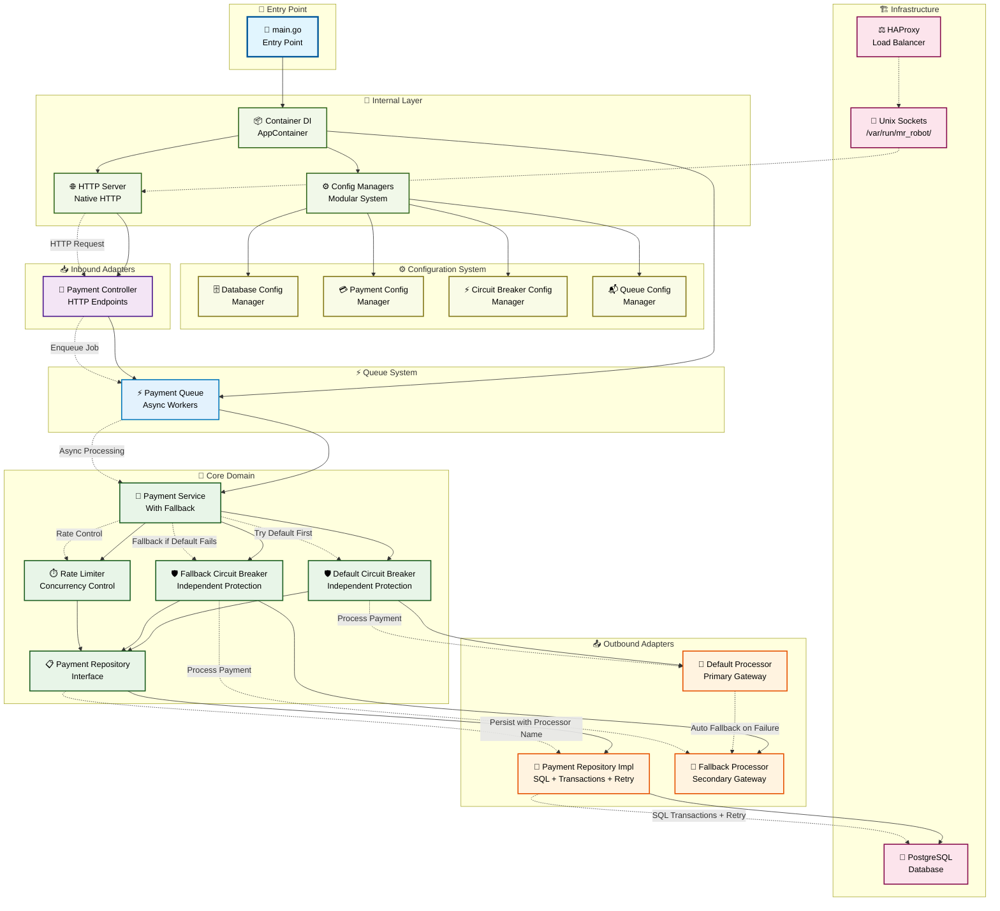
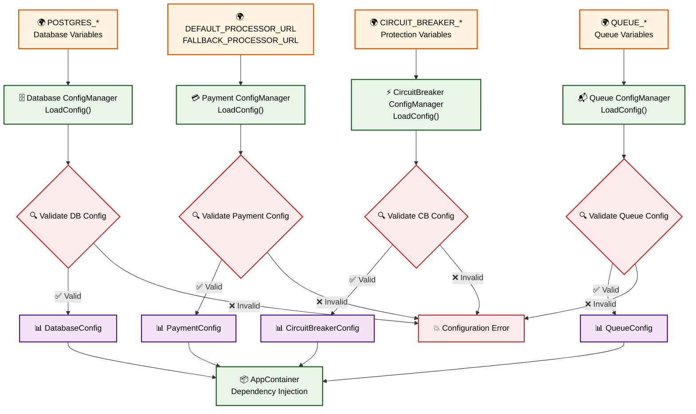
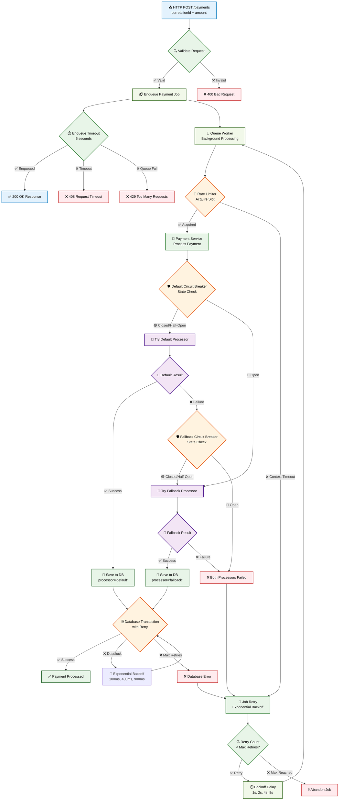
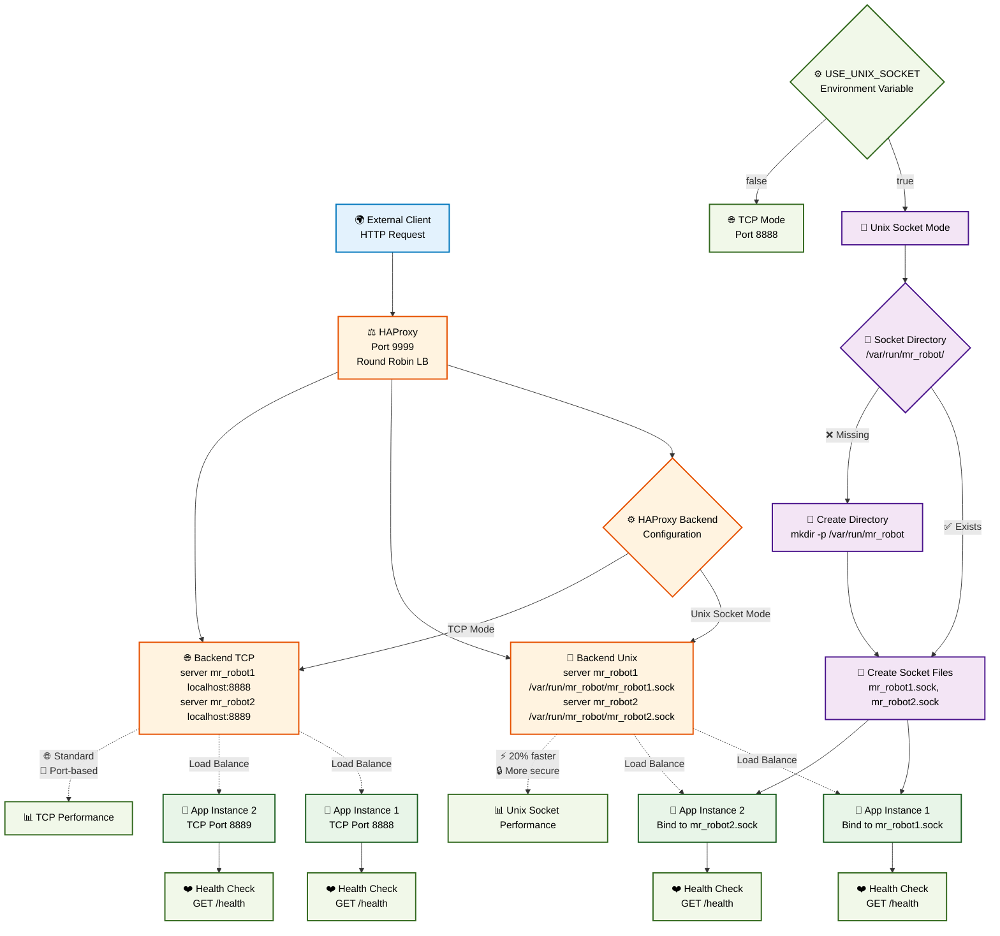

# Fluxogramas Atualizados mr-robot - Agosto 2025

> **Data de Atualização**: 16 de Agosto de 2025  
> **Versão**: v0.0.4  
> **Baseado em**: Análise do código atual  

## 🔄 Fluxograma de Arquitetura Principal (Atualizado)

## 🔧 Fluxograma de Configuração (Detalhado)

## 🚀 Fluxograma de Processamento de Pagamento (Detalhado)

## 🔌 Fluxograma de Unix Sockets (Detalhado)

## 📊 Fluxograma de Monitoramento e Métricas

```mermaid
flowchart TD
    %% Estilos
    classDef endpoint fill:#e3f2fd,stroke:#0277bd,stroke-width:2px,color:#000
    classDef metric fill:#e8f5e8,stroke:#1b5e20,stroke-width:2px,color:#000
    classDef aggregation fill:#fff3e0,stroke:#e65100,stroke-width:2px,color:#000
    classDef response fill:#f3e5f5,stroke:#4a148c,stroke-width:2px,color:#000

    %% Endpoints de monitoramento
    HEALTH["🏥 GET /health<br/>Application Health"]
    SUMMARY["📊 GET /payment-summary<br/>Payment Statistics"]
    PURGE["🗑️ DELETE /payments<br/>Purge All Data"]

    %% Health check components
    HEALTH --> HC_APP{"🔍 App Status"}
    HEALTH --> HC_DB{"🔍 Database Status"}
    HEALTH --> HC_QUEUE{"🔍 Queue Status"}
    HEALTH --> HC_CB{"🔍 Circuit Breakers"}

    HC_APP -->|"✅ OK"| H_OK["✅ 200 OK"]
    HC_DB -->|"✅ Connected"| H_OK
    HC_QUEUE -->|"✅ Running"| H_OK
    HC_CB -->|"🟢 Monitoring"| H_OK

    HC_APP -->|"❌ Error"| H_ERR["❌ 503 Service Unavailable"]
    HC_DB -->|"❌ Disconnected"| H_ERR
    HC_QUEUE -->|"❌ Stopped"| H_ERR
    HC_CB -->|"🔴 All Open"| H_ERR

    %% Payment summary components
    SUMMARY --> QUERY_DB["🗄️ Query Database<br/>Aggregate by Processor"]
    QUERY_DB --> AGG_DEFAULT["📈 Aggregate Default<br/>COUNT(*), SUM(amount)"]
    QUERY_DB --> AGG_FALLBACK["📈 Aggregate Fallback<br/>COUNT(*), SUM(amount)"]

    AGG_DEFAULT --> METRICS_DEF["📊 Default Metrics<br/>totalRequests, totalAmount"]
    AGG_FALLBACK --> METRICS_FALL["📊 Fallback Metrics<br/>totalRequests, totalAmount"]

    METRICS_DEF --> JSON_RESP["📋 JSON Response<br/>{default: {...}, fallback: {...}}"]
    METRICS_FALL --> JSON_RESP

    %% Time filtering
    SUMMARY --> TIME_FILTER{"🕐 Time Range Provided?"}
    TIME_FILTER -->|"✅ from & to"| FILTERED_QUERY["🗄️ Filtered Query<br/>WHERE created_at BETWEEN"]
    TIME_FILTER -->|"❌ No filter"| QUERY_DB
    FILTERED_QUERY --> AGG_DEFAULT
    FILTERED_QUERY --> AGG_FALLBACK

    %% Purge operation
    PURGE --> PURGE_AUTH{"🔐 Authorization Check"}
    PURGE_AUTH -->|"✅ Authorized"| PURGE_DB["🗑️ DELETE FROM payments"]
    PURGE_AUTH -->|"❌ Unauthorized"| PURGE_ERR["❌ 401 Unauthorized"]

    PURGE_DB --> PURGE_OK["✅ 204 No Content"]

    %% Circuit breaker metrics
    HC_CB --> CB_DEFAULT["🛡️ Default CB State<br/>Closed/Open/HalfOpen"]
    HC_CB --> CB_FALLBACK["🛡️ Fallback CB State<br/>Closed/Open/HalfOpen"]
    HC_CB --> CB_FAILURES["📊 Failure Counts<br/>Per Processor"]

    %% Queue metrics
    HC_QUEUE --> Q_WORKERS["👷 Active Workers<br/>Count"]
    HC_QUEUE --> Q_JOBS["📬 Queue Size<br/>Pending Jobs"]
    HC_QUEUE --> Q_PROCESSED["✅ Jobs Processed<br/>Total Count"]
    HC_QUEUE --> Q_FAILED["❌ Jobs Failed<br/>Total Count"]

    %% Aplicando estilos
    class HEALTH,SUMMARY,PURGE endpoint
    class METRICS_DEF,METRICS_FALL,CB_DEFAULT,CB_FALLBACK,CB_FAILURES,Q_WORKERS,Q_JOBS,Q_PROCESSED,Q_FAILED metric
    class QUERY_DB,AGG_DEFAULT,AGG_FALLBACK,FILTERED_QUERY,PURGE_DB aggregation
    class JSON_RESP,H_OK,H_ERR,PURGE_OK,PURGE_ERR response
```

## 🎯 Legenda dos Fluxogramas

### 🎨 Códigos de Cores

| Cor | Componente | Descrição |
|-----|------------|-----------|
| 🔵 **Azul** | Entry Point/External | Pontos de entrada e clientes externos |
| 🟢 **Verde** | Core/Internal | Lógica de negócio e componentes internos |
| 🟡 **Amarelo** | Configuration | Sistema de configuração e managers |
| 🟠 **Laranja** | Outbound/Processing | Adaptadores de saída e processamento |
| 🟣 **Roxo** | Inbound/Controllers | Adaptadores de entrada e controladores |
| 🔴 **Vermelho** | Infrastructure | Infraestrutura externa (DB, HAProxy) |
| ⚪ **Cinza** | Queue/Async | Sistema de filas e processamento assíncrono |

### 📊 Símbolos

| Símbolo | Significado |
|---------|-------------|
| `-->` | Fluxo síncrono |
| `-.->` | Fluxo assíncrono ou opcional |
| `{}` | Decisão/Condição |
| `[]` | Processo/Ação |
| `()` | Dados/Estado |

### 🚀 Estados do Circuit Breaker

| Estado | Cor | Descrição |
|--------|-----|-----------|
| 🟢 **Closed** | Verde | Funcionando normalmente |
| 🔴 **Open** | Vermelho | Bloqueando requisições |
| 🟡 **Half-Open** | Amarelo | Testando recuperação |

---

**📝 Nota**: Estes fluxogramas foram atualizados baseados na análise do código atual (v0.0.4) e refletem com precisão a implementação real do sistema.
