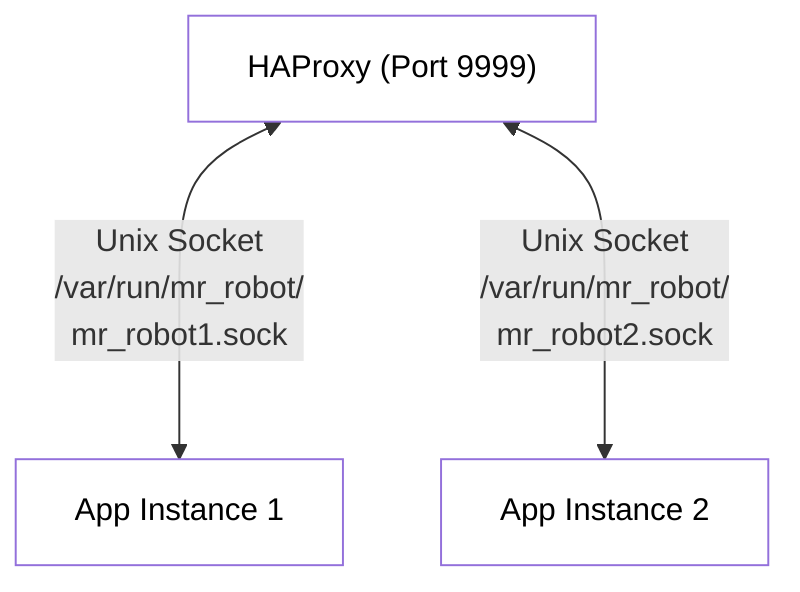

# Unix Sockets Implementation

## Overview

A aplicação Mr. Robot foi configurada para usar Unix sockets para comunicação entre o HAProxy (load balancer) e as instâncias da aplicação Go. Esta implementação oferece melhor performance e segurança em comparação com conexões TCP tradicionais.

## Arquitetura



## Configuração

### Variáveis de Ambiente

As seguintes variáveis de ambiente controlam o comportamento dos Unix sockets:

- `USE_UNIX_SOCKET=true`: Habilita o uso de Unix sockets
- `SOCKET_PATH`: Caminho para o arquivo de socket (específico para cada instância)

### Instâncias da Aplicação

Cada instância da aplicação cria um socket específico:

- **mr_robot1**: `/var/run/mr_robot/mr_robot1.sock`
- **mr_robot2**: `/var/run/mr_robot/mr_robot2.sock`

### Configuração do HAProxy

O HAProxy foi configurado para se conectar aos Unix sockets em vez de portas TCP:

```haproxy
backend mr_robot_backend
    balance roundrobin
    option httpchk GET /health
    http-check expect status 200

    # Backend servers using Unix sockets
    server mr_robot1 /var/run/mr_robot/mr_robot1.sock check
    server mr_robot2 /var/run/mr_robot/mr_robot2.sock check
```

## Implementação no Código Go

### Servidor HTTP

O servidor HTTP foi modificado para suportar tanto TCP quanto Unix sockets:

```go
if USE_UNIX_SOCKET && SOCKET_PATH != "" {
    // Create Unix socket listener
    listener, err = net.Listen("unix", SOCKET_PATH)
    if err != nil {
        log.Fatalf("Failed to create Unix socket listener: %v", err)
    }
    
    // Set socket permissions
    if err := os.Chmod(SOCKET_PATH, 0666); err != nil {
        log.Printf("Warning: could not set socket permissions: %v", err)
    }
    
    server = &http.Server{Handler: handler}
    log.Printf("Starting HTTP server on Unix socket: %s", SOCKET_PATH)
} else {
    // Use TCP port (fallback)
    server = &http.Server{
        Addr:    ":" + APP_PORT,
        Handler: handler,
    }
    log.Printf("Starting HTTP server on port %s", APP_PORT)
}
```

### Cleanup

O código inclui limpeza automática dos arquivos de socket durante o shutdown:

```go
// Clean up Unix socket file
if USE_UNIX_SOCKET && SOCKET_PATH != "" {
    if err := os.Remove(SOCKET_PATH); err != nil {
        log.Printf("Warning: could not remove socket file: %v", err)
    }
}
```

## Docker Configuration

### Volumes

Um volume compartilhado é usado para os sockets:

```yaml
volumes:
  socket_volume:
    name: mr_robot_sockets
    driver: local
```

### Containers

Cada container da aplicação monta o volume de sockets e define seu próprio `SOCKET_PATH`:

```yaml
app1:
  environment:
    - SOCKET_PATH=/var/run/mr_robot/mr_robot1.sock
  volumes:
    - socket_volume:/var/run/mr_robot

app2:
  environment:
    - SOCKET_PATH=/var/run/mr_robot/mr_robot2.sock
  volumes:
    - socket_volume:/var/run/mr_robot
```

O HAProxy monta o mesmo volume em modo read-only:

```yaml
lb:
  volumes:
    - socket_volume:/var/run/mr_robot:ro
```

## Vantagens dos Unix Sockets

1. **Performance**: Menor overhead comparado a TCP
2. **Segurança**: Comunicação local, sem exposição de rede
3. **Latência**: Menor latência na comunicação inter-processo
4. **Simplicidade**: Não requer gerenciamento de portas TCP

## Fallback para TCP

A implementação mantém compatibilidade com TCP. Para usar TCP em vez de Unix sockets:

1. Defina `USE_UNIX_SOCKET=false` ou remova a variável
2. Ajuste a configuração do HAProxy para usar endereços TCP
3. Exponha as portas necessárias nos containers

## Troubleshooting

### Verificar Status dos Sockets

```bash
# Listar sockets ativos
sudo ss -l | grep mr_robot

# Verificar permissões dos arquivos de socket
ls -la /var/run/mr_robot/
```

### Logs da Aplicação

Os logs indicarão se a aplicação está usando Unix sockets:

```log
Starting HTTP server on Unix socket: /var/run/mr_robot/mr_robot1.sock
```

### HAProxy Stats

Acesse `http://localhost:8404/stats` para verificar o status dos backends.

## Considerações de Segurança

- Os sockets são criados com permissões `0666` para permitir acesso do HAProxy
- O diretório `/var/run/mr_robot/` deve ter permissões adequadas
- Em produção, considere usar grupos específicos para controlar acesso
